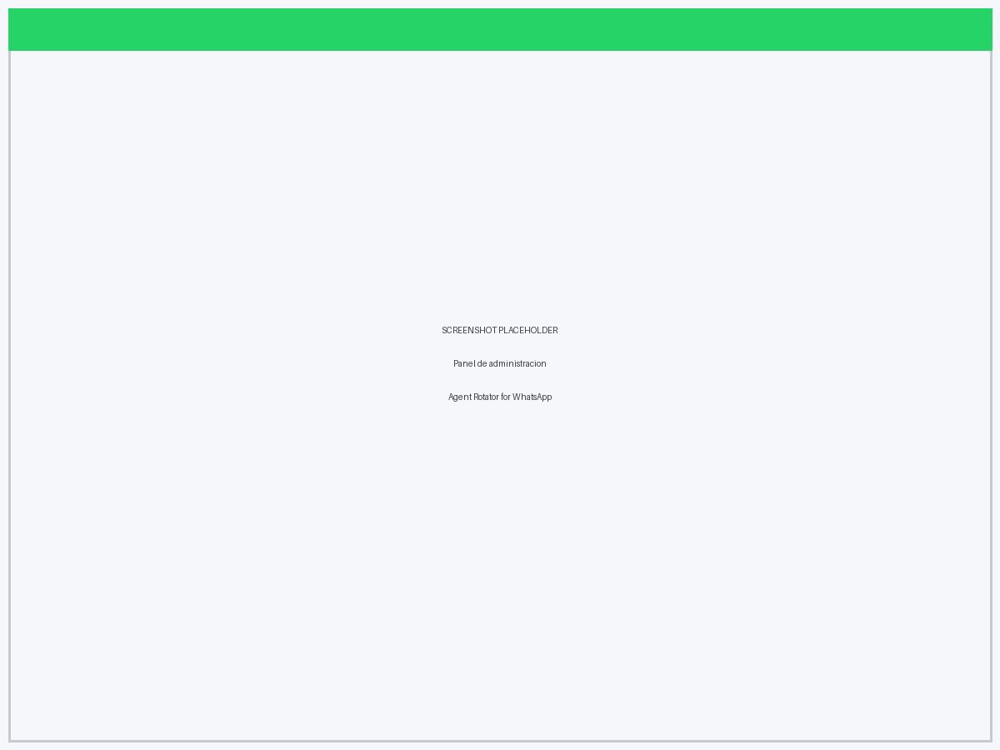
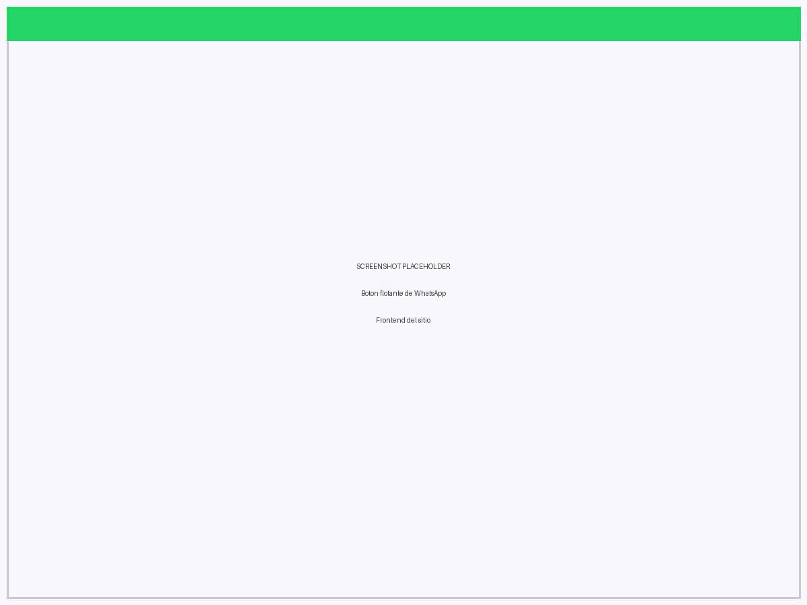

# Agent Rotator for WhatsApp — Lite

> Simple and clean contact rotator for WordPress. Adds a floating WhatsApp button that distributes incoming messages across your agents based on their active schedule.

---

## ✨ Features

- 🗓️ **Working days per agent** — choose which days each agent is active (Mon–Sun).
- 🕐 **Working hours per agent** — set start/end time. Overnight shifts (e.g. 22:00–06:00) fully supported.
- 🔄 **Round-robin rotation** — when several agents are active simultaneously, one is picked at random to distribute the load evenly.
- 🙈 **Smart hiding** — if no agent is on shift, the button stays hidden. Visitors never reach an offline agent.
- 💬 **Pre-filled message** — configurable global message for the WhatsApp chat.
- 🔒 **Secure by default** — nonce-protected settings form (CSRF-safe), strict sanitisation and validation on every save.
- 🌐 **i18n ready** — fully translatable. Text Domain: `agent-rotator-for-wa`.
- 🪶 **Zero dependencies** — no jQuery, no external libraries. Pure PHP + vanilla JS.

**Lite version:** up to **2 agents**.
→ Need unlimited agents and extra features? [Contact me for the Premium version](https://nrd.com.ar/contacto).

## 📸 Screenshots

| Admin panel | Frontend button |
|---|---|
|  |  |

## 📦 Installation

1. [Download the latest release](../../releases/latest) (`agent-rotator-for-wa.zip`).
2. In WordPress, go to **Plugins → Add New → Upload Plugin** and choose the ZIP — or upload the `agent-rotator-for-wa` folder to `/wp-content/plugins/`.
3. Activate the plugin through the **Plugins** screen.
4. Go to **WA Rotator** in the admin sidebar.
5. Add your agents: name, phone number (digits only, with country code, no `+`), working hours and active days.
6. Optionally set a global pre-filled message.
7. **Save Changes** — the floating button appears automatically when at least one agent is on shift.

## ⚙️ Requirements

- WordPress 5.9+
- PHP 7.4+

## ❓ FAQ

**How many agents can I add?**
The Lite version supports up to 2 agents. Premium removes the limit.

**Does the button show when no agents are active?**
No. It stays hidden until a configured agent is within their working hours and days.

**Are overnight schedules supported?**
Yes. If the start time is later than the end time (e.g. 22:00–06:00), it's treated as an overnight shift.

**Is it compatible with page builders?**
Yes. The button is injected via `wp_footer`, so it works with Elementor, Divi, Beaver Builder and any standard theme.

**Phone number format?**
Digits only, 6–15 digits, country code included without the leading `+` (e.g. `5491158887777`).

**Does it slow down my site?**
No. No frameworks, no external requests — just lightweight vanilla JS.

## 🤝 Contributing

Issues and feature requests are welcome in the [Issues tab](../../issues). For general conversation, use [Discussions](../../discussions).

## 📄 License

GPLv2 or later — see [LICENSE](LICENSE).

## 👤 Author

**Ivan Paolillo — NRD**
Diseñador Gráfico & Multimedial · UX/UI · Fullstack Dev · 🇦🇷 Argentina

🌐 [nrd.com.ar](https://nrd.com.ar) · 📧 [Contacto](https://nrd.com.ar/contacto)
